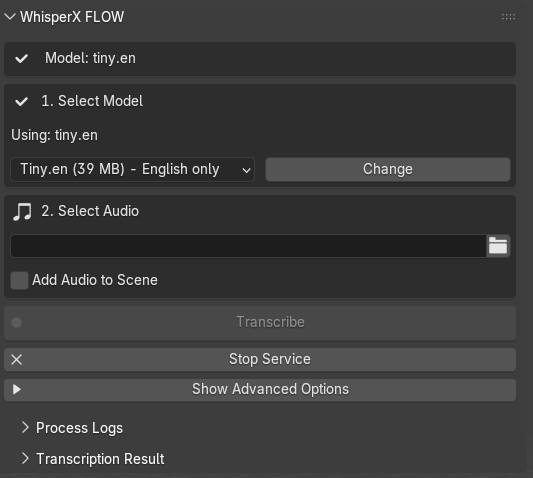

# WhisperX Transcription Blender Addon

[](https://www.blender.org/)
[](LICENSE)
[](https://github.com/yourusername/whisperx-blender-addon)

A powerful Blender addon that integrates WhisperX for high-quality audio transcription with word-level timestamps and speaker diarization directly within Blender.



## Features

- 🎯 **Accurate Word-Level Timestamps**: Generate precise word-level timestamps for audio transcription
- 👥 **Speaker Diarization**: Identify and label different speakers in your audio (currently CLI ONLY)
- 🚀 **Multiple Output Formats**: Export to NLA strips or Video Sequencer subtitles
- 🔄 **Batch Processing**: Efficiently process audio files with batched inference
- 🌐 **Multiple Languages**: Support for various languages through WhisperX's language models
- 🎛️ **Customizable Settings**: Adjust text size, position, and other parameters
- 🔌 **Seamless Integration**: Works directly within Blender's interface

## Table of Contents

- [Installation](#installation)
- [Requirements](#requirements)
- [Usage](#usage)
- [Model Sizes](#model-sizes)
- [Developer Options](#developer-options)
- [Troubleshooting](#troubleshooting)
- [License](#license)
- [CLI usage for developers](#cli-workflow)

## Installation

### Method 1: Install from ZIP

1. Download the latest release ZIP file from the [Releases page](https://github.com/yourusername/whisperx-blender-addon/releases)
2. In Blender, go to `Edit > Preferences > Add-ons > Install...`
3. Select the downloaded ZIP file and click "Install Add-on"
4. Enable the addon by checking the box next to "Audio: WhisperX Transcription"

### Method 2: Manual Installation

1. Download or clone this repository
2. Copy the entire folder to your Blender addons directory:
   - Windows: `%APPDATA%\Blender Foundation\Blender\3.x\scripts\addons\`
   - macOS: `~/Library/Application Support/Blender/3.x/scripts/addons/`
   - Linux: `~/.config/blender/3.x/scripts/addons/`
3. In Blender, go to `Edit > Preferences > Add-ons`
4. Search for "WhisperX" and enable the addon

## Requirements

### Python Dependencies

The addon requires the following Python packages:

```
whisperx
torch
torchaudio
numpy
pyannote.audio (for speaker diarization)
```
## CLI Workflow

### Basic usage
1. **Start the Service**: open up command prompt and run the following `python path/to/WisperX_runner.py`
2. **Load up a model**: `load-model(model_name)`
3. **transcribe audio**: `transcribe-audio(path, Diarization=True/False)`
4. **JSON**: The script will output all data formatted as JSON
5. **exit**: `exit()`


## Usage

### Basic Workflow

1. **Start the Service**: Click "Start Service" to initialize the WhisperX backend
2. **Select a Model**: Choose a model size based on your needs (see [Model Sizes](#model-sizes))
3. **Load the Model**: Click "Load Model" to load the selected model
4. **Select Audio**: Choose an audio file to transcribe
5. **Transcribe**: Click "Transcribe" to process the audio
6. **Use the Results**: After transcription, you can:
   - Send to NLA: Create animation strips for each word
   - Send to Video Editor: Create text strips in the Video Sequencer
   - Copy Transcript: Copy the full text to clipboard

### Panel Location

The addon adds panels in two locations:
- 3D View > Sidebar > WhisperX tab
- Properties > Tools > WhisperX Transcription

### Advanced Options

- **Script Path**: Specify the location of the whisperx_runner.py script
- **NLA Buffer Name**: Customize the name of the NLA buffer object
- **Text Size**: Adjust the size of text in the Video Sequencer
- **Text Position**: Set the position of text (Bottom, Center, Top)
- **Use Words/Segments**: Choose between word-level or segment-level strips

## Model Sizes

WhisperX provides several model sizes with different capabilities and resource requirements:

| Model | Size | Speed | Accuracy | Memory Required | Best For |
|-------|------|-------|----------|----------------|----------|
| tiny | 39 MB | Fastest | Lowest | ~1 GB | Quick drafts, short clips |
| tiny.en | 39 MB | Fastest | Low (English only) | ~1 GB | English-only quick drafts |
| base | 74 MB | Fast | Moderate | ~1 GB | General use, medium accuracy |
| base.en | 74 MB | Fast | Moderate (English only) | ~1 GB | English-only general use |
| small | 244 MB | Medium | Good | ~2 GB | Better accuracy, longer content |
| small.en | 244 MB | Medium | Good (English only) | ~2 GB | English-only longer content |
| medium | 769 MB | Slow | Very good | ~5 GB | High accuracy needs |
| medium.en | 769 MB | Slow | Very good (English only) | ~5 GB | English-only high accuracy |
| large-v3 | 1.5 GB | Slowest | Best | ~10 GB | Professional transcription |

### Model Selection Tips

- **For quick drafts**: Use `tiny` or `tiny.en` models
- **For balanced performance**: Use `base` or `small` models
- **For highest accuracy**: Use `medium` or `large-v3` models
- **For non-English content**: Use the multilingual models (without `.en` suffix)
- **For limited GPU memory**: Use smaller models or enable the `int8` compute type

## Developer Options

### Modifying the Addon

The addon is structured as follows:

- **Main Panel**: `WHISPERX_PT_main_panel` class
- **Process Control**: `WHISPERX_OT_start_service`, `WHISPERX_OT_stop_service` classes
- **Transcription**: `WHISPERX_OT_transcribe_audio` class
- **Output Handling**: `WHISPERX_OT_send_to_nla`, `WHISPERX_OT_send_to_vse` classes

### Extending Functionality

To extend the addon:

1. Fork the repository
2. Make your changes
3. Test thoroughly
4. Submit a pull request

### Adding Custom Models

To add support for custom models:

1. Modify the `available_models` EnumProperty in the `WhisperXProperties` class
2. Update the model loading logic in the whisperx_runner.py script

## Troubleshooting

### Common Issues

#### Service Won't Start

- Ensure Python and all dependencies are installed
- Check that the whisperx_runner.py script is in the correct location
- Verify that the script path is correctly set in the addon preferences

#### Model Loading Fails

- Check that you have enough GPU memory for the selected model
- Try a smaller model size
- Ensure you have an internet connection for downloading models

#### Transcription Errors

- Check that the audio file format is supported (mp3, wav, etc.)
- Ensure the audio file path doesn't contain special characters
- Try processing a shorter audio clip first

#### No Word Timestamps

- Make sure the alignment model is available for your language
- For non-English languages, use the appropriate language code

### Error Messages

- **"Script not found"**: The whisperx_runner.py script couldn't be located
- **"Service not responding"**: The WhisperX service crashed or is unresponsive
- **"Error loading model"**: Insufficient memory or model download issues
- **"No words found in transcription data"**: The transcription process failed to identify words

## License

This project is licensed under the BSD-2-Clause License - see the [LICENSE](LICENSE) file for details.

## Acknowledgements

- [WhisperX](https://github.com/m-bain/whisperX) by Max Bain for the core transcription technology
- [OpenAI Whisper](https://github.com/openai/whisper) for the base speech recognition model
- [Pyannote Audio](https://github.com/pyannote/pyannote-audio) for speaker diarization capabilities
